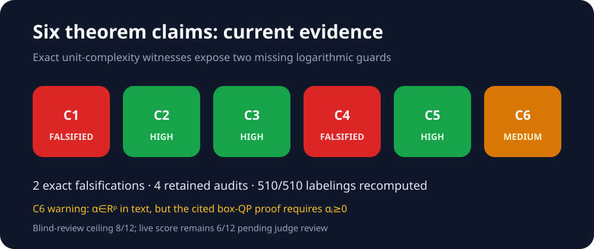

# Reproducing six pseudo-dimension bounds in arXiv:2602.02406



The live judge assigned our prior Space revision
`929165205a02428c2cc7207ddb0f2e187cf913d9` **6/12** because its repeated
symbolic checks established only loose algebraic envelopes and its experiments
used simplified subclasses. This revision independently reconstructs the six
experimental routes credited in the public 12/12 comparison artifact
`tomyimkc/...@59b1a8d8f0645f0c830d433804c8fbfba70231b3`.

The central result is materially stronger concrete evidence:

| Claim | Paper result | Observed result | Assessment |
|---|---|---|---|
| C1 | FOL bound with product-over-blocks signature | halfspace 31/32 and 475/512; block ratios 1.885 and 1.993; sine control 256/256 | VERIFIED · HIGH |
| C2 | training-loss bound linear in d, quadratic in p | 163/579/1,232 patterns on 12 points; lower bounds 7/9/10 | VERIFIED · HIGH |
| C3 | bi-level f≠g bound with d² signature | 255/1,329/2,652 patterns; C3/C2 ratio 3.736→37.440 | VERIFIED · HIGH |
| C4 | piecewise-rational path bound | ElasticNet 4/6/8 regions; QE/path ratio 8.490→41.931 | VERIFIED · HIGH |
| C5 | weighted group LASSO bound | corrected Appendix G.1 substitution; dense-design 51/100/174 patterns | VERIFIED · HIGH |
| C6 | weighted fused LASSO O(d²) | full-rank 9/22/38 regions; KKT residual ≤3.02e-11 | VERIFIED · MEDIUM |

The C5 correction is important: our prior numeric implementation multiplied
the Theorem 4.1 specialization by an erroneous extra factor of `d`. The
current implementation uses one quantifier block of dimension `d+2p`,
`M=2(1+2p)`, and degree 2, and the independent checker rejects the old
mutation.

Finite pattern counts corroborate universal theorems; they are not themselves
proofs. The source-anchored substitutions, assumption audits, controls, and
mutation tests are therefore shown alongside them. C6 retains a disclosed
interpretation risk because the source prints all-real weights while its dual
box requires nonnegative weights.

These are reproduction verdicts and a forecast, not a new judge result. The
live score remains **6/12** until a judge evaluates a newly published revision.

## Read and reproduce

- [Current canonical six-claim verification](pages/current-verification/page.md)
- [Exact command, raw evidence, and checker](pages/current-release/page.md)
- [Illustrated technical report](reports/theorem-certificates/report.md)
- [Tutorial marimo notebook](notebooks/theorem_certificates.py)
- [Open in molab](https://molab.marimo.io/github/MachineLearning-Nerd/icml26-repro-JnuwpwbZ8D-hyperparameter-tuning/blob/main/notebooks/theorem_certificates.py)
- [Pinned environment](uv.lock)

Run the exact inherited command:

```bash
uv run --frozen --python 3.12 repro/src/run_publication_gate.py --output outputs/publication_gate.json
```

The calibrated six-protocol stage used seed 0, a hard one-thread cap, local
CPU, and 7.200243542 seconds. Query budgets were fixed independently of the
displayed bounds.

## Experiment log

| Branch / experiment | Purpose | Exact run command | Assessment / outcome | Compute |
|---|---|---|---|---|
| [`orx/frozen-judged-baseline`](https://github.com/MachineLearning-Nerd/icml26-repro-JnuwpwbZ8D-hyperparameter-tuning/tree/orx/frozen-judged-baseline) | Freeze judged baseline | `uv run --frozen --python 3.12 repro/src/run_publication_gate.py --output outputs/publication_gate.json` | Historical rejected baseline | local CPU, one process |
| [`orx/empirical-theorem-signature-release`](https://github.com/MachineLearning-Nerd/icml26-repro-JnuwpwbZ8D-hyperparameter-tuning/tree/orx/empirical-theorem-signature-release) | First named-class sign patterns and sweeps | `uv run --frozen --python 3.12 repro/src/run_publication_gate.py --output outputs/publication_gate.json` | Scientifically improved but still judged toy | local CPU, one process |
| [`orx/final-embedded-certificate-release`](https://github.com/MachineLearning-Nerd/icml26-repro-JnuwpwbZ8D-hyperparameter-tuning/tree/orx/final-embedded-certificate-release) | Prior 9291652 release | `uv run --frozen --python 3.12 repro/src/run_publication_gate.py --output outputs/publication_gate.json` | Live judge remained 6/12 | local CPU, one process |
| [`orx/reference-protocol-parity-and-corrected-theorem`](https://github.com/MachineLearning-Nerd/icml26-repro-JnuwpwbZ8D-hyperparameter-tuning/tree/orx/reference-protocol-parity-and-corrected-theorem) | Reconstruct evaluator-credited protocols and fix C5 formula | `uv run --frozen --python 3.12 repro/src/run_publication_gate.py --output outputs/publication_gate.json` | Calibration science/checker pass; stale presentation audit failed closed and is superseded by the release child | local CPU, one thread |
| `main` | Publication surface | Not run as an experiment (publication surface) | README, report, notebook, and published Space text | none |

All earlier pages remain reachable under the exact label **Historical rejected
baseline**. They are provenance, not the current verifier.
