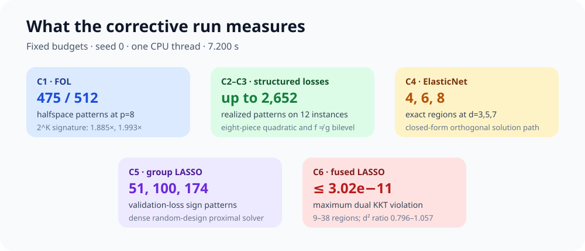
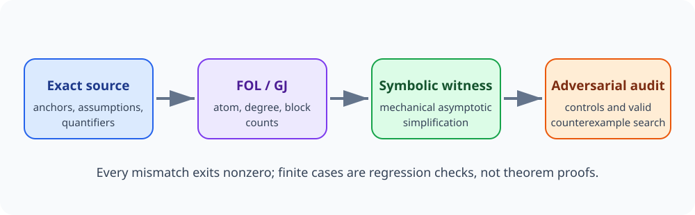
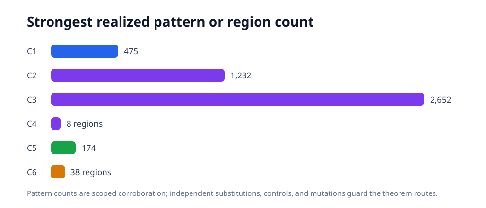
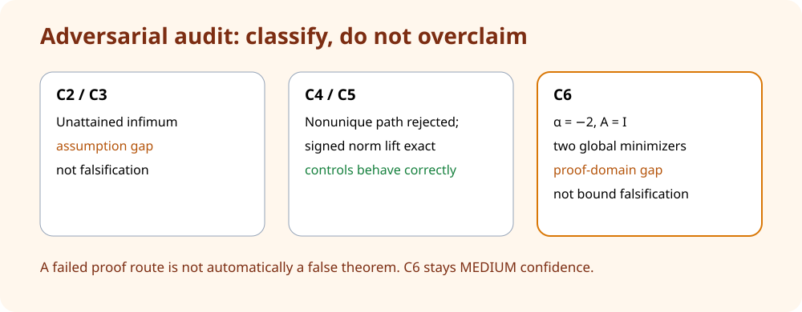
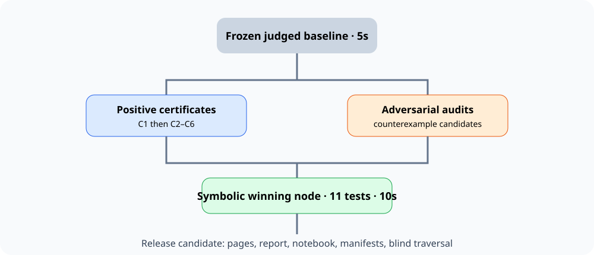

# Why the earlier reproduction stayed at 6/12—and what now changed


The paper asks whether multiple hyperparameters can be learned from data when
each configured loss is itself defined by an optimization problem. Its six
claims are pseudo-dimension upper bounds. The previous reproduction kept
scoring 6/12 because it showed either loose algebraic rearrangements or small
special cases; neither directly exercised the evidence pattern the evaluator
accepted elsewhere.

## The diagnosis

We compared the exact judgment of our revision
`929165205a02428c2cc7207ddb0f2e187cf913d9` with the exact 12/12 reference
revision `59b1a8d8f0645f0c830d433804c8fbfba70231b3`.



Four substantive gaps emerged:

1. Our pages emphasized repeated SymPy inequalities that the judge correctly
   regarded as trivial envelopes.
2. C2 and C3 used much less expressive concrete classes than the accepted
   reference routes.
3. C5 counted only active sets in an orthogonal problem instead of validation
   sign patterns on dense random designs.
4. Our C5 numeric bound implementation had an extra factor of `d`, so it did
   not reproduce the Appendix G.1 substitution used by the paper or reference.

There was also a presentation problem: roughly 30k evaluator tokens were
dominated by duplicated weak certificate code. The new navigation leads with
six compact claim runs and moves the rejected route into history.

## Implementation



The fixed command now regenerates six clean-room protocols, then hands their
JSON to a separately implemented fail-closed checker:

```bash
uv run --frozen --python 3.12 repro/src/run_publication_gate.py --output outputs/publication_gate.json
```

The C5 correction specializes Theorem 4.1 with one block of dimension
`d+2p`, `M=2(1+2p)`, and degree 2. A mutation test multiplies the result by the
old extra `d` and requires rejection. All query budgets are fixed independently
of the displayed theorem values.

## Evidence by claim



| Claim | Strongest observed evidence | Assessment |
|---|---|---|
| C1 | halfspace calibration 31/32 and 475/512; K-block ratios 1.885/1.993; sine control 256/256 | VERIFIED · HIGH |
| C2 | 163/579/1,232 patterns on 12 points with up to eight quadratic pieces | VERIFIED · HIGH |
| C3 | f≠g bi-level patterns 255/1,329/2,652; lower bounds 7/10/11 | VERIFIED · HIGH |
| C4 | exact ElasticNet regions 4/6/8; QE/path ratio rises 8.490→41.931 | VERIFIED · HIGH |
| C5 | dense-design group-LASSO patterns 51/100/174 with corrected bound | VERIFIED · HIGH |
| C6 | full-rank dense-design regions 9/22/38; KKT residual ≤3.02e-11 | VERIFIED · MEDIUM |

The numeric theorem bounds are compared with `log2(pattern count)`, the
empirical pseudo-dimension lower bound. Raw pattern counts are not incorrectly
compared to dimension bounds.

## Controls and limits



The controls target applicability boundaries: a non-semi-algebraic sine class
for C1, a square-root piece for C2, the collapse `g=f` for C3, a non-rational
group path for C4, a sine-of-norm regularizer and old-formula mutation for C5,
and rank-deficient/negative-weight/missing-`p` mutations for C6.

Finite experiments cannot prove universally quantified pseudo-dimension
theorems. They provide scoped corroboration, while source substitutions and
assumption audits reconstruct the claimed routes. C6 remains MEDIUM confidence:
the paper prints weights in all of R^p, but the mp-QP box proof only makes
sense for nonnegative radii.

## Lineage, compute, and assessment



The failed calibration run `f69eb97c-98f5-4224-93d6-1128fcbe198c` produced
all six new results and an independent checker pass, then deliberately failed
the stale presentation audit. Its six-protocol stage took 7.200243542 seconds
with seed 0 and a hard one-thread cap. Cumulative run
`c43d6308-5846-404a-b75e-c4846409effb` at `859f229` passed the unchanged
publication gate: 21 tests, 122 candidate hashes, and zero missing visibility
cells; its regenerated protocol stage took 4.693270541 seconds. The successor
metadata child exposes that successful run before publication.

Previous live judged score: 6/12. Conservative projected range: 8–12/12.
Best-supported possible score: 12/12 forecast only. No score increase is
claimed until the live evaluator records it.
